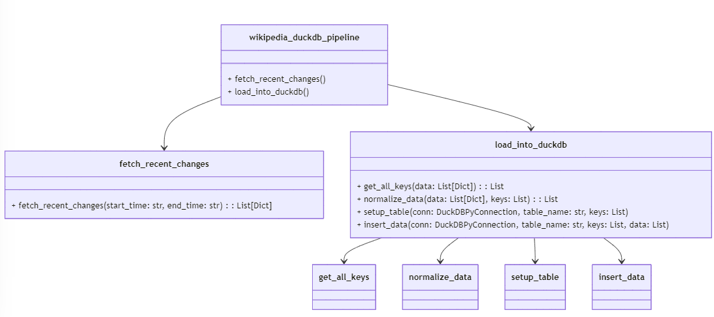
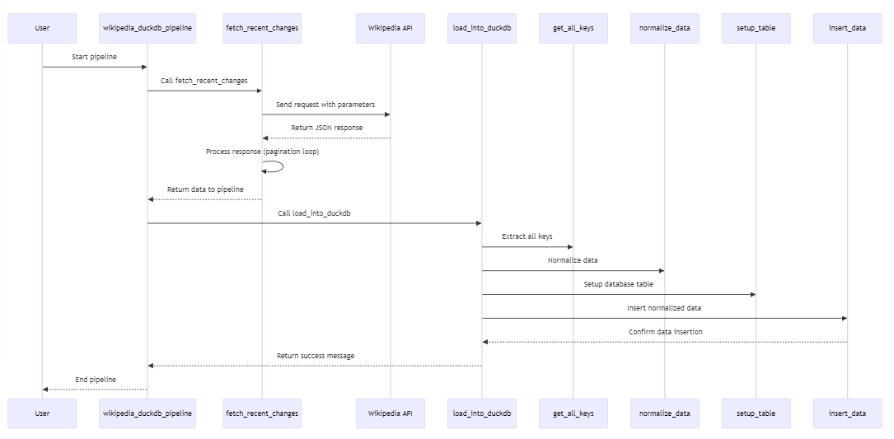

# Wikipedia API to DuckDB
## Extract and load
Main Pipeline: wikipedia_duckdb_pipeline

Calls functions to fetch recent changes from the Wikipedia API and load them into a DuckDB database.

Core Functions:

- fetch_recent_changes: Extracts recent changes from Wikipedia's API using parameters for time range.
- load_into_duckdb: Handles data loading into DuckDB, including table setup and insertion.
- get_all_keys & normalize_data: Ensures consistent schema for the data.
- setup_table & insert_data: Creates the table dynamically and inserts data using DuckDB.

Key Data Flow:

- Data flows from Wikipedia's API ➡️ Normalization ➡️ DuckDB.

Unit tests are provided in [test_extract_from_wikipedia.py](python/test_extract_from_wikipedia.py)

## dbt transformations
Transformations happen according to a medaillon architecture:

- bronze: raw data loaded by Python script
- silver: technical correction of the raw data, casting of columns to correct data ype
- gold: final data product with 
    - [a view that lists the activity per timeslot](dbt_wikipedia_changes/models/gold_most_active_timeslots.sql)
    - [a view with the timeslot with the highest activity](dbt_wikipedia_changes/models/gold_timeslot_highest_activity.sql)

dbt tests for gold_most_active_timeslots can be found in [gold_most_active_timeslots.yml](dbt_wikipedia_changes/models/gold_most_active_timeslots.yml)

## running the pipeline

[Run unit tests, extract, load and transform](run_all.sh)

[Verify intermediate results and end result in notebook](python/manual_test_queries_duckdb.ipynb)

## possible improvements
The following points could be possible improvements but were not implemented due to time constraints:
- Run an async pipeline using smaller intervals instead of one big one
- Store raw json data coming from the API on a local filesystem or storage account
    - Now a minor transformation already happens before the data is inserted
    - If the DuckDB load fails, all the data has to be retrieved again